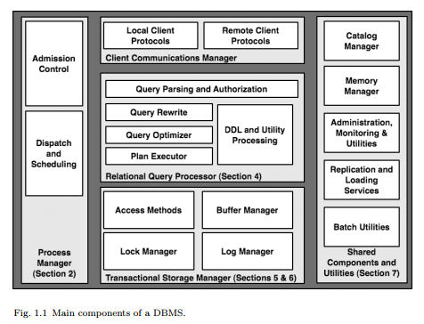

# 介绍

数据库管理系统（DBMS）是复杂的，重在任务处理的软件系统。数据库管理系统发展至今，经历了数十年的学术和工业研究以及密集的企业软件开发。数据库系统，作为最早被广泛部署的在线服务器之一系统，开创了很多设计解决方案，这些方案不仅用于数据管理，还用于应用程序，操作系统和联网服务。早期的DBMS是在计算机科学领域是最有影响力的软件之一，因此在数据库管理系统中很多领先过的思想和实现被广泛复制和重新发明。

出于多种原因，数据库系统体系结构上经验教训并不像理应那样地广为人知。首先，应用数据库系统社区相当小。由于在高端使用层面上的市场质量有限，成功的DBMS的个数用用手指头都数的过来。而参与在这些数据库系统设计和实现的人也来自很小的圈子：很多人来自同一个的学校，或者因为曾在同一个的有影响力的研究项目里工作过，或者曾在同一个的商业产品上合作过。二是数据库系统架构的学术待遇也很低。数据库系统的教科书一贯集中于算法和理论问题（当然这对于教学，学习和测试来说是很自然的），而没有实现统架构层面的全面讨论。结果是，关于如何构建数据库的传统知识是存在的，但这些知识很少被写下来或被广泛宣传。

在这篇文章中，我们试图捕捉主要的现代数据库系统架构上的问题，并讨论其中高层次的一些问题。这些问题，有的出现在文献中，有的问题是隐藏在产品手册中，有的问题则是社区里口口相传的。只要有可能，我们使用商业和开源系统作为例子来进行讨论。但是由于页数限制，文章将不会列举那些隐藏在几十年间开发出来的几百万行代码中的例外和细微差别。通常的教科书为算法和概念提供了有用的背景，这篇文章的目标则是关注鲜被讨论的架构设计和压力问题。我们假设读者已经熟悉了教科书中的数据库系统资料（例如[72]或[83]）以及现代操作系统（如UNIX，Linux或Windows）的基本用法。1.1节将介绍一个DBMS的高层架构，1.2节将提供一些这个高层架构的各个组件的背景阅读资料。

## 1.1 关系型数据库系统：从查询的生命周期说起

现在的产品中，最成熟和应用最广泛的数据库系统是关系型数据库管理系统（RDBMS）。关系型数据库系统是在世界上许多应用的核心，仅举几例：电子商务，医疗记录，计费，人力资源，工资，客户关系管理和供应链管理。网络商务和面向社区网站的出现又增加了关系型数据库使用的数量和广度。关系型数据库系统作为记录的存储库，为几乎所有的在线交易和大多数在线内容管理系统（博客，维基，社交网络等）服务。除了作为重要的软件基础，作为一个被充分理解的参考点，关系型数据库系统也为未来可能发生的数据库扩展和革命而服务。因此，在这篇文章中，我们讨论关系型数据库系统。

在本质上，典型的RDBMS有五个主要组成部分，如图1.1所示。介绍每个组件和他们组合方式，分析一个查询（query）在数据库中的生命周期是一个很好的切入点。这也可以作为这篇文章余下部分的概述。

考虑一个简单但典型的数据库交互：在机场，登机门服务员点击一个表格请求一个航班的乘客名单。一次点击按钮会产生一个单一查询，流程大致如下：
1. 登机门的个人电脑（即“客户”）调用一个API，这个API通过网络与DBMS的 __客户通信管理器具__（__Client Communication Manager__）（图1.1的顶部）建立通信。在某些情况下，这个通信直接建立在客户端和数据库服务器之间建立，例如通过ODBC或JDBC连接协议。这被称为“两层”或“客户-服务器”系统。在其他情况下，客户端与 __中间层服务器__（网络服务器，事务处理监视器等）通信，然后这些中间层服务器使用协议代理客户端与DBMS之间的通信。这通常被称为“三层”系统。在很多网络情景下，还有一个“应用服务器”层处在网络服务器和DBMS之间，形成了“四层”。鉴于这些不同的选择，典型的DBMS需要兼容许多不同的用于客户端驱动程序和中间件系统的连接协议。尽管协议多样，但是根本上，DBMS的客户通信管理器的责任大致是相同的：建立并记住连接调用者（无论是客户端还是中间件服务器）的状态，响应来自调用者的SQL命令，并返回合适的数据和控制消息（结果代码，错误等）。在我们这个简单的查询示例中，通信管理器将建立客户的安全凭证，创建状态去记住新的连接细节和当前的SQL命令，并向DBMS传达客户的首个请求。
2. 在收到客户端的首个SQL命令后，DBMS必须给命令分配一个“计算线程”。它还必须确保线程的数据和控制输出通过通信管理器返回给该客户。这些任务是DBMS __进程管理器__（__Process Manager__）（图1.1的左侧）的工作。数据库管理系统在这一阶段的最重要的决定是 __入场控制__（__admission control__）：系统是否应该立即开始处理查询，或推迟执行直到有足够的资源可供使用。我们将在第二节详细讨论进程管理。
3. 一旦计算线程被准入和分配资源，登机门服务员的查询可以开始被执行。DBMS调用 __关系查询处理器__（__Relational Query Processor__）（图1.1的中心）的代码。这组模块检查用户是否有权执行该查询，并将用户的SQL查询文本编译成一个内部 __查询计划__（__query plan__）。编译完成后，生成的查询计划被 __计划执行者__（__plan executor__）处理。计划执行者由一套“运算单元”（关系型算法实现）组成，用于执行任何查询。典型的运算单元包括连接，选择，投影，聚合，排序等，以及从系统的下层请求数据记录。在我们的查询示例中，这些运算单元的一部分，由查询优化过程汇集，被调用来满足查询。我们会在第4节讨论查询处理器。
4. 在取得了登机门服务员的查询计划的基础上，会有一个或多个运算单元从数据库请求数据。这些运算单元从DBMS的 __事务存储管理器__（__Transactional Storage Manager__）（图1.1的底部）中获取数据。事务存储管理器负责所有的数据访问（读取）和操作（创建，更新，删除）。存储系统包括算法和数据结构来组织和访问（“访问方法”）磁盘上的包括数据表和索引等数据。它还包括一个缓冲区管理模块来决定何时以及在哪些数据之间进行转换磁盘和内存缓冲区。回到我们的例子，在使用访问方式来访问数据的过程中，登机门服务员的查询必须调用事务管理代码确保事务的被周知的“ACID”属性[30]（5.1节中有更详细地讨论）。访问数据之前，如果有其他并发查询，锁管理器将获取锁以确保执行的正确性。如果登机门服务员的查询涉及到数据库的更新，那么此查询会与日志管理器进行交互，以确保事务一旦被承诺执行其效果将是持久的，而如果被中止，则其效果将被完全撤消。在第5节中，我们将讨论存储和缓冲区管理的更多细节；第6部分会涵盖保证事务一致性的架构。
5. 在查询的生命周期中，至此，查询已经开始访问数据记录，并准备好了使用数据来计算客户需要的结果。取得计算结果需要回溯（“解开堆栈”）我们目前为止所描述的所有活动：访问方法取得结果元组（result tuples），将控制权交还给查询执行的操作单元；操作单元协调结果元祖的计算；结果元组被生成，然后被放置在一个缓冲区供客户通信管理器使用；然后客户通信管理器将结果返回过调用者。对于庞大的结果集，客户端通常会进行额外的调用来获取更多的数据，导致在通信管理器，查询执行器，和存储管理器之间的多次迭代。在我们简单的查询示例中，在查询的最后，事务被完成了并且连接被关闭了；这会导致事务管理器清理为了这个事务所产生的状态，进程处理器也会解除该查询的所有控制结构，并且通信管理器会清理这次连接所产生的所有通讯状态。

我们围绕这个查询示例的讨论涉及了RDBMS中许多关键组件，但不是全部。图1.1的右边描绘了许多共享组件和实用程序，它们对于DBMS的整体运行也至关重要。目录和内存管理器在任何事务处理中均被调用，自然包括我们的查询示例。查询处理器使用目录用于认证，解析和查询优化。每当内存需要被动态分配或释放时，内存管理器都被使用。在图1.1最右边的框中列出的其余模块是独立与特定的查询的存在，但是保持数据库的整体健康和可靠。我们将在第7节讨论这些共享的组件和实用程序。

## 1.2 范围和概述

在本文的大部分内容中，我们关注的是支持支持数据库核心功能的体系结构基础知识。我们并不试图提供一个对在文献中被扩展讨论的数据库算法的综述。现代DBMS中存在的许多扩展功能，提供了非核心数据管理的功能，但不显著改变系统架构，因此我们也只提供最少的讨论。但是，在文中的各个部分，如果我们注意到有些有趣的话题，超出了我们设定的讨论范围，我们尽可能地提供额外的阅读参考。

我们将从对于数据库系统整体架构的调查开始我们的讨论。任何服务器系统架构中的第一个主题是其整体流程结构，我们探索各种可行的在这方面的替代品，首先是单处理机，然后是当今可用的各种并行架构。这个关于核心服务器系统架构的讨论适用于多种系统，但在数据库管理系统设计方面却是一个很大的先例。接着，我们会讨论数据库管理系统的更多专用的组件。我们用单个查询的角度开始，重点关注关系型查询处理器。接下来，我们进入存储架构和事务存储管理设计。最后，我们介绍一些很少在教科书中被讨论的大多数DBMS中存在的共享组件和实用程序。
